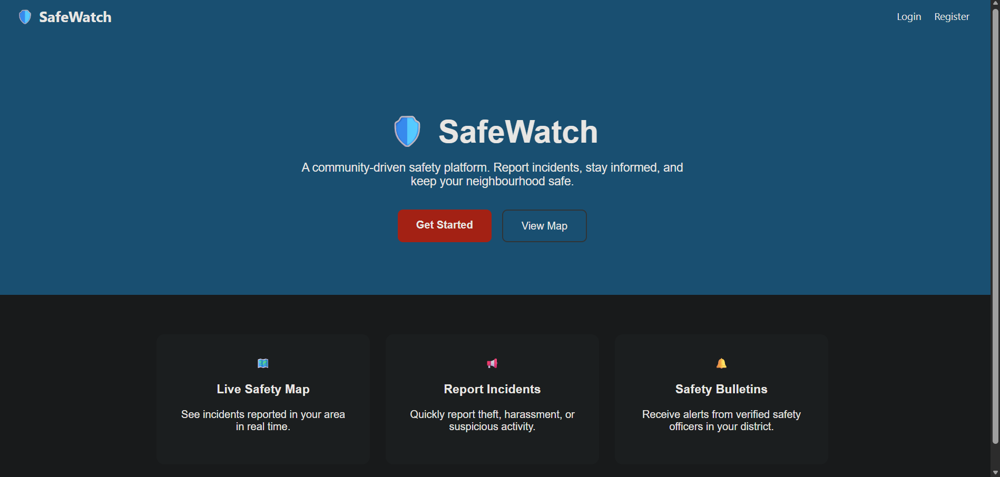
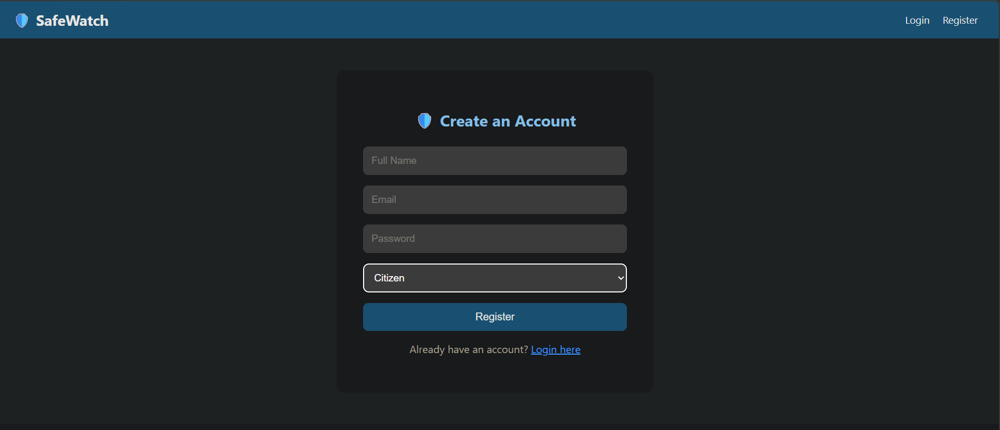
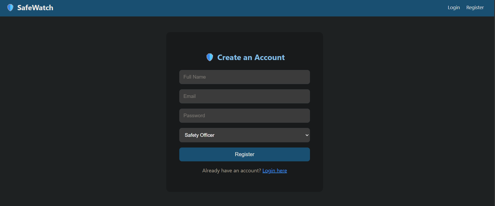
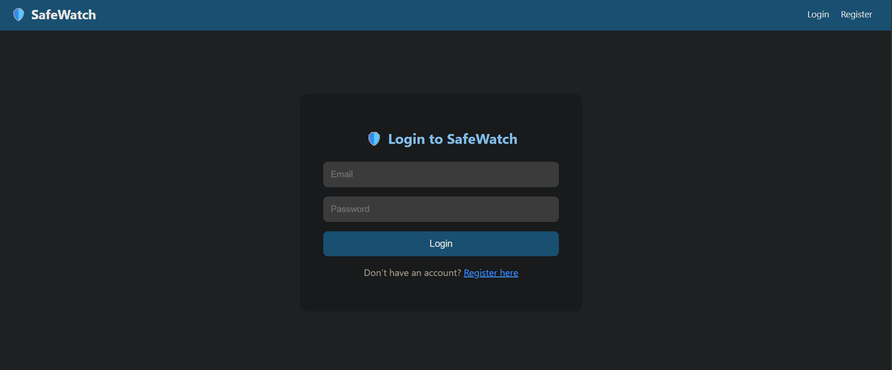
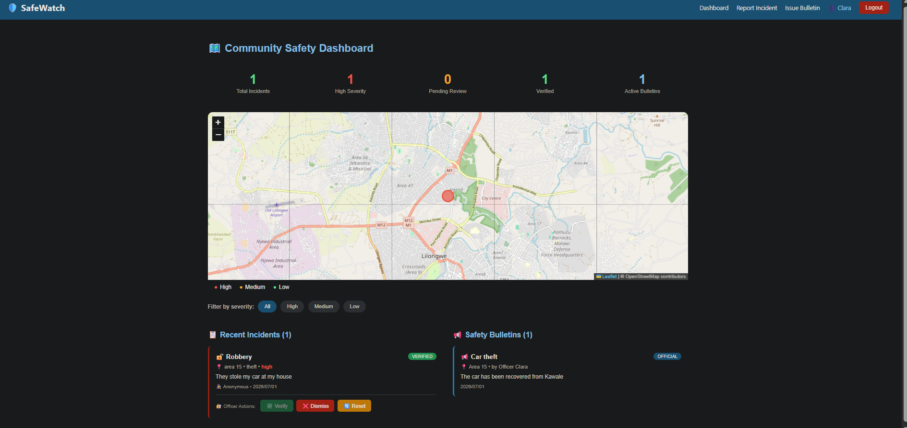
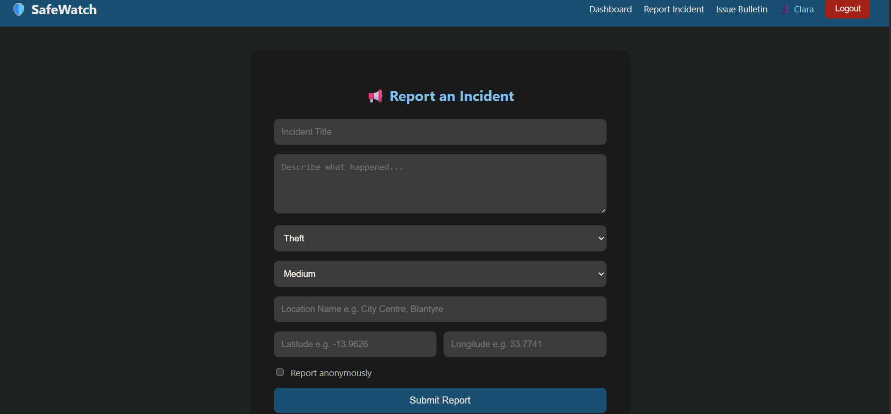
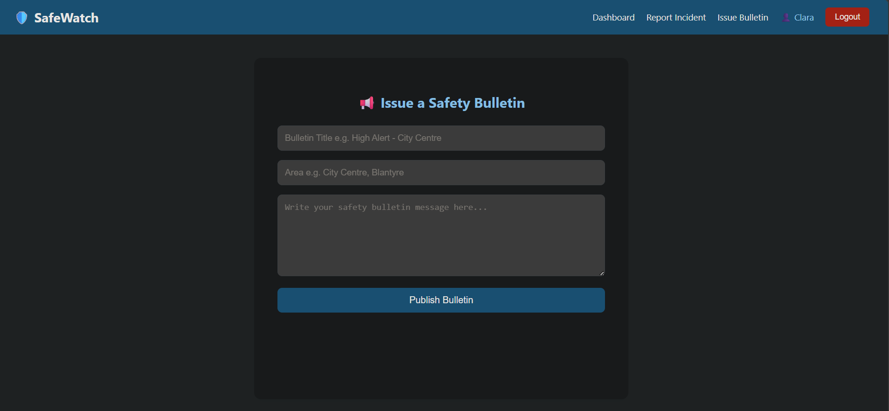

# 🛡️ SafeWatch — Community Incident Reporting & Personal Safety Platform

SafeWatch is a full-stack web application that empowers communities to report, track, and respond to security incidents in real time. Built as a final project for **Code Blossom**, SafeWatch addresses a real-world problem faced by citizens in Malawi and across Sub-Saharan Africa — the lack of a structured, accessible platform for community safety intelligence.

---

## 🌍 The Problem It Solves

Citizens frequently encounter security threats — theft, harassment, unsafe areas at night — yet have no structured way to report these incidents or warn others in their community. SafeWatch bridges this gap by putting real-time, community-generated safety intelligence into the hands of every citizen and safety officer.

---

## ✨ Features

### For Citizens
- 📢 Report security incidents (theft, harassment, vandalism, suspicious activity, poor lighting)
- 🗺️ View a live safety map with color-coded incident markers
- 🔍 Filter incidents by severity (high, medium, low)
- 🕵️ Submit reports anonymously
- 📋 View safety bulletins issued by officers

### For Safety Officers
- ✅ Verify or dismiss reported incidents
- 📢 Publish district-wide safety bulletins
- 📊 Monitor incident statistics on the dashboard

---

## 🛠️ Tech Stack

| Area | Technology |
|---|---|
| Front-end | React |
| Back-end | Node.js + Express |
| Database | MySQL |
| Map | Leaflet.js + OpenStreetMap |
| Authentication | JWT (JSON Web Tokens) |
| Password Hashing | bcryptjs |
| Deployment | Netlify (front-end) + Railway (back-end) |

---

## 📁 Project Structure

```
safewatch/
├── client/                  # React front-end
│   └── src/
│       ├── components/      # Navbar
│       ├── context/         # AuthContext (global auth state)
│       └── pages/           # Home, Login, Register, Dashboard, ReportIncident, CreateBulletin
└── server/                  # Node.js + Express back-end
    ├── config/              # Database connection
    ├── controllers/         # Business logic
    ├── middleware/           # JWT auth middleware
    └── routes/              # API route definitions
```

---

## 🚀 Getting Started

### Prerequisites
- Node.js v18+
- MySQL 8.0+

### 1. Clone the repository
```bash
git clone https://github.com/YOUR_USERNAME/safewatch.git
cd safewatch
```

### 2. Set up the database
```bash
mysql -u root -p
```

```sql
CREATE DATABASE safewatch;
USE safewatch;

CREATE TABLE users (
  id INT AUTO_INCREMENT PRIMARY KEY,
  name VARCHAR(100) NOT NULL,
  email VARCHAR(100) NOT NULL UNIQUE,
  password VARCHAR(255) NOT NULL,
  role ENUM('citizen', 'safety_officer', 'admin') DEFAULT 'citizen',
  created_at TIMESTAMP DEFAULT CURRENT_TIMESTAMP
);

CREATE TABLE incidents (
  id INT AUTO_INCREMENT PRIMARY KEY,
  title VARCHAR(150) NOT NULL,
  description TEXT NOT NULL,
  category ENUM('theft', 'harassment', 'vandalism', 'suspicious_activity', 'poor_lighting', 'other') NOT NULL,
  severity ENUM('low', 'medium', 'high') DEFAULT 'medium',
  latitude DECIMAL(10, 8) NOT NULL,
  longitude DECIMAL(11, 8) NOT NULL,
  location_name VARCHAR(255),
  photo_url VARCHAR(500),
  is_anonymous BOOLEAN DEFAULT FALSE,
  status ENUM('pending', 'verified', 'dismissed') DEFAULT 'pending',
  user_id INT,
  created_at TIMESTAMP DEFAULT CURRENT_TIMESTAMP,
  FOREIGN KEY (user_id) REFERENCES users(id) ON DELETE SET NULL
);

CREATE TABLE bulletins (
  id INT AUTO_INCREMENT PRIMARY KEY,
  title VARCHAR(150) NOT NULL,
  message TEXT NOT NULL,
  area VARCHAR(255) NOT NULL,
  issued_by INT NOT NULL,
  created_at TIMESTAMP DEFAULT CURRENT_TIMESTAMP,
  FOREIGN KEY (issued_by) REFERENCES users(id) ON DELETE CASCADE
);
```

### 3. Set up the back-end
```bash
cd server
npm install
```

Create a `.env` file inside the `server/` folder:
```env
PORT=4000
DB_HOST=localhost
DB_USER=your_mysql_username
DB_PASSWORD=your_mysql_password
DB_NAME=safewatch
JWT_SECRET=your_secret_key
```

Start the server:
```bash
npm run dev
```

### 4. Set up the front-end
```bash
cd ../client
npm install
npm start
```

The app will open at `http://localhost:3000`

---

## 🔑 User Roles

| Role | Access |
|---|---|
| `citizen` | Report incidents, view map and bulletins |
| `safety_officer` | Everything above + verify/dismiss incidents + issue bulletins |

---

## 📡 API Endpoints

### Auth
| Method | Endpoint | Description |
|---|---|---|
| POST | `/api/auth/register` | Register a new user |
| POST | `/api/auth/login` | Login and receive a JWT token |

### Incidents
| Method | Endpoint | Description | Auth Required |
|---|---|---|---|
| GET | `/api/incidents` | Get all incidents | No |
| GET | `/api/incidents/:id` | Get a single incident | No |
| POST | `/api/incidents` | Report a new incident | Yes |
| PUT | `/api/incidents/:id` | Update an incident | Yes |
| PATCH | `/api/incidents/:id/status` | Verify or dismiss an incident | Officer only |
| DELETE | `/api/incidents/:id` | Delete an incident | Yes |

### Bulletins
| Method | Endpoint | Description | Auth Required |
|---|---|---|---|
| GET | `/api/bulletins` | Get all bulletins | No |
| GET | `/api/bulletins/:id` | Get a single bulletin | No |
| POST | `/api/bulletins` | Publish a bulletin | Officer only |
| PUT | `/api/bulletins/:id` | Update a bulletin | Officer only |
| DELETE | `/api/bulletins/:id` | Delete a bulletin | Officer only |

---

## 📸 Screenshots

### Home Page


### Registration Page



### Login Page


### Dashboard


### Report Incident


### Issue Safety Bulletin


---

## 🔮 Future Features

- 👥 **Admin Dashboard** — manage all users, change roles, delete content
- 🔄 **Role Management** — promote citizens to safety officers from the admin panel
- 📊 **Advanced Analytics** — crime heatmap trends over time for admins
- 📱 **Mobile App** — React Native version for iOS and Android
- 🌐 **Chichewa Language Support** — full Malawi local language translation
- 📧 **Email Notifications** — alerts for high severity incidents near saved locations
- 🤝 **Malawi Police Integration** — connect with official police reporting system

---

## 🌐 Live Demo
- Frontend: https://safewatchmw.netlify.app
- Backend API: https://safewatch-production-9ec1.up.railway.app

## 👩‍💻 Author

**Ruth Chirwa**  
Code Blossom Final Project — 2026

---

## 📄 License

This project is open source and available under the [MIT License](LICENSE).